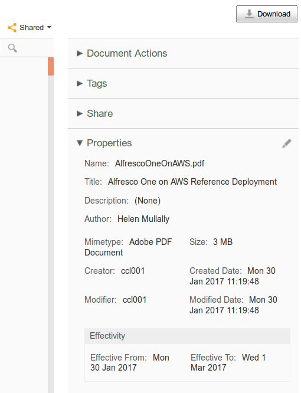

# Public url documents (qshared) with effectivity in Alfresco Share

This customization provides a custom behaviour when qshared aspect is applied on documents, i.e., when a document has a public url in Alfresco Share. It adds the effectivity aspect (cm:effectivity), setting a validity period of 30 days for the document. Once the validity period is expired a daily quartz is run for removing qshared aspect, unpublishing the public url. A custom metadata template and indicator are also included.

## Packaging

Just generate maven packages. Go into the directory that you unzipped, or cloned via git:

    $ git clone https://github.com/zylklab/zk-qshared-effectivity
    $ cd zk-qshared-effectivity
    $ cd zk-qshared-effectivity-repo
    $ mvn clean && mvn package -DskipTests=true
    $ cd ..
    $ cd zk-qshared-effectivity-share
    $ mvn clean && mvn package -DskipTests=true

The generated AMPs are located in corresponding target directories. 

## Installing
 - Just copy the corresponding AMP into $ALF_HOME/amps and $ALF_HOME/amps_share, stop Alfresco service, apply AMPs script ($ALF_HOME/bin/apply_amps.sh) and start Alfresco service.

## Using

When the content is shared, a custom behaviour adds cm:effectivity aspect and sets 30 days period for effectivity. Once the effectivity period is over, a custom quartz job removes the qshare:shared aspect, unpublishing the url.

A custom metadata template and indicator improves the visualization of the simple and detailed views of the documents in the Document Library.

## More config
 - Additionaly, you may also use a virtual folder template located at (alfresco/resources/json/qsharedFolder.json)

## Links

Based on blog posts:
 - http://www.zylk.net/es/web/guest/web-2-0/blog/-/blogs/how-to-control-public-shared-content-in-alfresco
 - http://www.zylk.net/es/web/guest/web-2-0/blog/-/blogs/programando-tareas-en-alfresco

## Tested

It should work in Alfresco 4.2 and above
